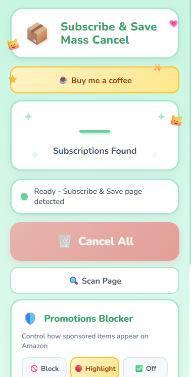
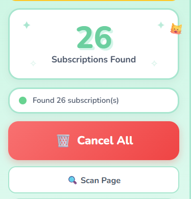
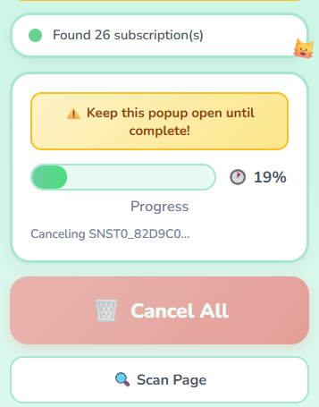
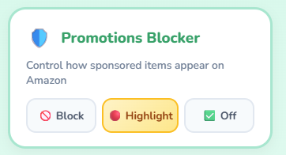

# 🛒 Amazon Subscribe & Save Mass Cancel

> Bulk cancel all your Amazon Subscribe & Save subscriptions in one click. Block or highlight sponsored promotions.

<a href="https://chromewebstore.google.com/detail/amazon-ss-mass-cancel/cclmjhhloncemallfneleaphpnpflfab">
  
</a>


<a href="https://ko-fi.com/hedidev">
  
</a>

## The Problem

Amazon Subscribe & Save is great for discounts, but managing dozens of subscriptions is tedious. Canceling them one-by-one takes forever, especially if you only wanted the discount and not the recurring delivery.

**This extension fixes that** — cancel all your subscriptions with a single click.

## ✨ Features

- 🚀 **One-Click Mass Cancel** — Cancel all subscriptions at once
- 🌍 **International Support** — Works on all Amazon sites (US, UK, CA, DE, FR, JP, AU, etc.)
- 📊 **Real-Time Progress** — Watch the progress bar as each item is canceled
- ⚡ **Direct API Calls** — No popup spam, no new tabs
- 🛡️ **Rate Limit Protection** — Built-in delays to avoid Amazon blocks
- 📝 **Error Reporting** — See exactly which items failed (if any)
- 🛡️ **Promotions Blocker** — Block or highlight sponsored items across all Amazon pages
  - 🚫 **Block mode** — Completely hides sponsored products
  - 🔴 **Highlight mode** — Outlines sponsored items in red
  - ✅ **Off mode** — Leaves everything as-is (default)

## 📦 Installation

### Step-by-Step Download Guide

<details>
<summary><strong>Click here for detailed instructions with screenshots</strong></summary>

#### Step 1: Download the Extension

1. On this page, click the green **Code** button
2. Click **Download ZIP**
3. Save the ZIP file to your computer

#### Step 2: Extract the ZIP

1. Find the downloaded `amazon-sns-mass-cancel-master.zip` file
2. Right-click → **Extract All** (Windows) or double-click (Mac)
3. Remember where you extracted it

#### Step 3: Install in Chrome

1. Open Chrome and type `chrome://extensions/` in the address bar, then press Enter
2. In the top-right corner, toggle **Developer mode** ON
3. Click the **Load unpacked** button
4. Navigate to the extracted folder and select `amazon-sns-mass-cancel-master`
5. Click **Select Folder**

#### Step 4: Pin the Extension (Optional)

1. Click the puzzle piece icon 🧩 in Chrome's toolbar
2. Find "Amazon Subscribe & Save Mass Cancel" and click the pin 📌 icon

</details>

### Quick Install (For Developers)

```bash
git clone https://github.com/headebeast/amazon-subscribe-save-mass-cancel.git
```
Then load the folder as an unpacked extension in `chrome://extensions/`.

## 🚀 Usage

1. **Navigate** to your [Subscribe & Save page](https://www.amazon.com/auto-deliveries/subscriptionList?listFilter=active)
2. **Scroll down** and click "Show more subscriptions" until all items are visible
3. **Click** the extension icon in your toolbar
4. **Click "Scan Page"** to detect all subscriptions
5. **Click "Cancel All"** to cancel them

That's it! Watch the progress bar as each subscription is canceled.

## 📸 Screenshots

### 🖥️ Extension Popup

The main popup with all features — mass cancel, scan, and promotions blocker.

<p align="center">
  
</p>

---

### 🔍 Subscriptions Detected

After clicking **Scan Page**, the extension finds all active subscriptions on the page.

<p align="center">
  
</p>

---

### ⏳ Cancellation in Progress

Real-time progress bar while subscriptions are being canceled one by one.

<p align="center">
  
</p>

---

### 🛡️ Promotions Blocker

Block or highlight sponsored products across all Amazon pages.

<p align="center">
  
</p>

## ⚠️ Important Notes

- **Emails**: Amazon sends a confirmation email for each canceled subscription. Expect inbox activity.
- **Irreversible**: Cancellations cannot be undone. You'll need to re-subscribe manually if needed.

### Supported Amazon Sites

🇺🇸 US | 🇬🇧 UK | 🇨🇦 Canada | 🇩🇪 Germany | 🇫🇷 France | 🇮🇹 Italy | 🇪🇸 Spain | 🇯🇵 Japan | 🇮🇳 India | 🇧🇷 Brazil | 🇲🇽 Mexico | 🇦🇺 Australia | 🇳🇱 Netherlands | 🇸🇪 Sweden | 🇵🇱 Poland | 🇸🇬 Singapore | 🇦🇪 UAE | 🇸🇦 Saudi Arabia

## 🛠️ Technical Details

### How It Works

1. **Extraction**: The extension scrapes subscription IDs from the page DOM using multiple fallback methods
2. **Cancellation**: Makes direct `fetch()` calls to Amazon's internal cancellation API endpoint
3. **Rate Limiting**: 500ms delay between requests to avoid triggering Amazon's bot detection

### API Endpoint Used

```
GET https://www.amazon.{domain}/auto-deliveries/ajax/cancelSubscriptionAction
  ?actionType=cancelSubscription
  &canceledNextDeliveryDate={timestamp}
  &subscriptionId={id}
```

### Project Structure

```
amazon-subscribe-save-mass-cancel/
├── manifest.json          # Chrome extension manifest (V3)
├── popup/
│   ├── popup.html         # Extension popup UI
│   ├── popup.css          # Theme styling
│   └── popup.js           # Main cancellation logic + promotions toggle
├── content/
│   ├── extractor.js       # Content script for S&S page detection
│   ├── promotions-blocker.js   # Content script for sponsored item detection
│   └── promotions-blocker.css  # Styles for block/highlight modes
└── icons/
    ├── icon16.png
    ├── icon48.png
    └── icon128.png
```

## ☕ Support

If this extension saved you time, consider buying me a coffee!

<a href="https://ko-fi.com/hedidev">
  
</a>

## 🤝 Contributing

Contributions are welcome! Feel free to:

- 🐛 Report bugs
- 💡 Suggest features
- 🔧 Submit pull requests

## 📄 License

**All Rights Reserved** — Personal use only. See [LICENSE](LICENSE) for details.

---

**Disclaimer**: This is an unofficial tool and is not affiliated with Amazon. Use at your own risk.
